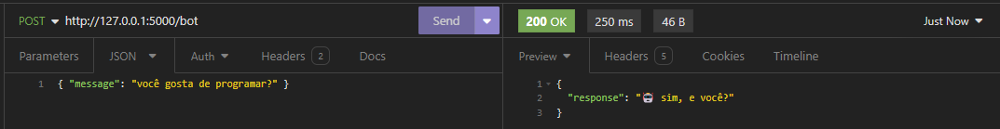

# 🤖ChatBot


## Install requirements

```bash
pip install -r requirements.txt
```
Note: this application requires Python 3.7.

## Standalone
```bash
path_to_python3.7_exec pd-chatbot\bot.py 
```

## Socket
First run the socket server program. 
```bash
path_to_python3.7_exec pd-chatbot\socket\server.py 
```
Then, in another terminal, run the socket client program.
```bash
path_to_python3.7_exec pd-chatbot\socket\client.py 
```
Now just write the input in the client program and wait for the server (the chatbot) to respond.

## RPC
Running the RPC implementation is similar to what was described above for Socket. In a terminal, we first run the server.
```bash
path_to_python3.7_exec pd-chatbot\rpc\server.py 
```
Then, in another terminal, we run the client.
```bash
path_to_python3.7_exec pd-chatbot\rpc\client.py 
```
Same as the Socket version, inputs are made on the client side; wait for the bot response via RPC server.

## Web service
The web service was built using [Flask](https://flask.palletsprojects.com/en/3.0.x/) and the application runs on localhost:5000 (or http://127.0.0.1:5000), route "/bot". The user must submit (HTTP Post) a JSON via body in the format {"message": "lorem ipsum"} and the return will be a JSON like {"response": "lorem ipsum"}  in which the value of "response" is the response of the bot.



## About the authors and the project
This project was developed for the Distributed Programming class, taught by professor Frederico Lopes at the Federal University of Rio Grande do Norte. 2024.1. 
### Authors
- [Antony Lemos](https://github.com/antonylemos)
- [Rita Cruz](https://github.com/rcchcz/)